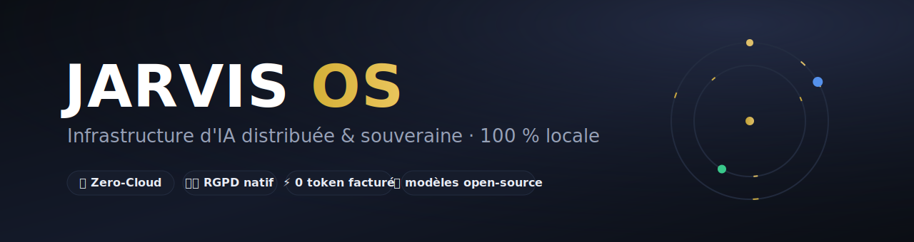

<div align="center">



<br/>

**L'intelligence artificielle qui vous appartient.**
Infrastructure d'IA distribuée & souveraine — 100 % locale, zéro cloud, RGPD natif.

<br/>

[](https://alkymia-oss.netlify.app)
[](https://www.linkedin.com/in/franck-delmas-80bb231b1/)
[](https://youtu.be/H6NNMm1eeDY)
[](mailto:franckdelmas00@gmail.com)

<br/>


</div>

---

## 📑 Sommaire

| # | Section | Contenu |
|---|---|---|
| 1 | [🎯 Présentation](#-présentation) · [`01-presentation/`](01-presentation/) | Pitch, dossier marketing, présentation commerciale |
| 2 | [📊 Preuves & benchmarks](#-preuves--benchmarks) · [`02-preuves/`](02-preuves/) | Rapport visuel, audit de cohérence, chiffres vérifiés |
| 3 | [🎬 Démonstration](#-démonstration) · [`03-demo/`](03-demo/) | Pipeline vidéo, narration, captures live |
| 4 | [📚 Dossier technique](#-dossier-technique) · [`04-dossier-technique/`](04-dossier-technique/) | Pack complet, storyboard, distribution |
| — | [🧭 Architecture](#-architecture) · [🛡️ Conformité](#️-conformité--normes) · [📬 Contact](#-contact) | |

---

## 🎯 Présentation

> **JARVIS OS transforme un simple Ubuntu Linux en un système d'exploitation IA autonome,
> 100 % local et sans coût cloud récurrent.** Là où un Linux standard exécute des commandes,
> JARVIS *orchestre* : il route l'intelligence, s'auto-répare, se surveille et travaille en continu —
> sur du matériel grand public.

| | Solutions cloud classiques | **JARVIS OS** |
|---|---|---|
| 🗄️ Données | dans le cloud | **100 % chez le client** |
| 💸 Coût | abonnements croissants | **infrastructure possédée · 0 € récurrent** |
| 🔗 Fournisseur | verrouillage | **toutes IA · modèles open-source** |
| 🖥️ Matériel | imposé | **s'adapte au parc existant** |
| 🎙️ Pilotage | souris / écran | **voix (STT + TTS intégrés)** |
| ♻️ Résilience | redémarrage manuel | **auto-réparation < 8 s · uptime 99,7 %** |

📄 **Dossier complet** → [`01-presentation/PRESENTATION.md`](01-presentation/PRESENTATION.md)
🎨 **Présentation commerciale (visuel)** → [`01-presentation/presentation-commerciale.html`](01-presentation/presentation-commerciale.html) · [PDF](01-presentation/presentation-commerciale.pdf)

---

## 📊 Preuves & benchmarks

*Mesures réelles du 17/07/2026 — pas des estimations.*

<div align="center">

| 🎯 Fiabilité | 🏠 Local | ⚡ Latence | 🚀 Débit | 🗣️ Vocal | 💰 Coût |
|:---:|:---:|:---:|:---:|:---:|:---:|
| **99,6 %** | **91,8 %** | **~1,1 s** | **51 tok/s** | **WER 10,51 %** | **0 €** |
| sur 4 413 appels | trafic sur M1 | médiane | max | dataset FLEURS | 0 token payant |

</div>

**Livrable de référence chronométré** — scraper « catalogue → CSV » (type Fiverr/Upwork) :
> Freelance : ~2 h · 25–60 $ &nbsp;→&nbsp; **JARVIS OS : 36 s · 0 €** (200× plus rapide, 100 % on-premise).

📊 **Rapport visuel (graphiques)** → [`02-preuves/rapport-visuel.html`](02-preuves/rapport-visuel.html)
🔍 **Audit de cohérence (traçabilité)** → [`02-preuves/AUDIT_COHERENCE.pdf`](02-preuves/AUDIT_COHERENCE.pdf)

<details>
<summary><b>Écosystème d'agents — triade vérifiée (cliquer)</b></summary>

<br/>

| Chiffre | Périmètre | Somme |
|---|---|---|
| **961** | Agents indexés (cœur cowork) | 848 + 82 + 28 + 3 |
| **1 354** | Toutes couches (entreprise) | 961 + 58 + 71 + 169 + 95 |
| **1 435** | Inventaire OMEGA (le plus large) | 11 catégories |

Trois périmètres emboîtés, pas trois valeurs concurrentes — chaque total traçable en une commande.

</details>

---

## 🎬 Démonstration

*Captures réelles, en production locale — pas de maquette.*

<div align="center">

| ▶️ Démo 1 — Présentation | ▶️ Démo 2 — Système en action |
|:---:|:---:|
| [](https://youtu.be/H6NNMm1eeDY) | [](https://youtu.be/C29E64kHMtU) |

</div>

🎞️ **Pipeline vidéo (navigable)** → [`03-demo/PIPELINE-DEMO-VIDEO.html`](03-demo/PIPELINE-DEMO-VIDEO.html)
🗣️ **Script de narration** → [`03-demo/narration-scene-complete.txt`](03-demo/narration-scene-complete.txt)

---

## 📚 Dossier technique

| Document | Contenu |
|---|---|
| [`PACK_PRESENTATION.pdf`](04-dossier-technique/PACK_PRESENTATION.pdf) | Dossier complet — 6 sections (archi, benchmarks, hardware, widget, agents) |
| [`STORYBOARD-COMPLET.pdf`](04-dossier-technique/STORYBOARD-COMPLET.pdf) | Storyboard chapitré (Linux → aujourd'hui) |
| [`DISTRIBUTION-MONTAGE-IA.pdf`](04-dossier-technique/DISTRIBUTION-MONTAGE-IA.pdf) | Fiche distribution & montage IA (0-coût) |
| [`youtube-metadata.md`](04-dossier-technique/youtube-metadata.md) | Métadonnées YouTube |

---

## 🧭 Architecture

```
                         ┌──────────────────────────┐
        Voix / Web /      │   HUB LLM 0-token (M1)    │   Cascade multi-modèles
        Tablette  ───────▶│  routeur · cache · LB1/2 │──────────┐
                         └────────────┬─────────────┘          │
                                      │ 127.0.0.1               ▼
             ┌────────────────────────┼────────────────────────────────┐
             ▼                        ▼                                 ▼
       ┌───────────┐          ┌───────────┐                     ┌───────────┐
       │  M1  🧠   │          │  M5  🎙️   │                     │  M2  ⚙️   │
       │ LLM + orch│          │ vocal+MCP │                     │ calcul GPU │
       │ 3 GPU     │          │ PostgreSQL│                     │ 3×RTX4000  │
       └───────────┘          └───────────┘                     └───────────┘
       agents · skills · auto-réparation < 8 s · backups horaires · widget supervision
```

**Souveraineté** : toutes les communications inter-nœuds transitent par `127.0.0.1`.
Bases & secrets on-premise (SQLite / PostgreSQL / Redis) · bascule cloud optionnelle, jamais imposée.

---

## 🛡️ Conformité & normes

- 🇪🇺 **RGPD natif** — aucune donnée ne quitte l'infrastructure du client.
- 🔒 **Zero-Cloud** — communications sur `127.0.0.1`, 0 sous-traitant cloud.
- 📖 **Open-source · MIT** — modèles hébergés localement, pas de vendor lock-in.
- 📊 **Traçabilité** — chiffres figés sur décompte vérifié, architecture entièrement documentée.
- ⚡ **0 jeton facturé** — modèles locaux (qwen3.5-9b) + cascade de secours gratuite.

---

## 📬 Contact

<div align="center">

**Franck Delmas** — CTO & Architecte Systèmes IA · Toulouse

[](https://alkymia-oss.netlify.app)
[](https://www.linkedin.com/in/franck-delmas-80bb231b1/)
[](mailto:franckdelmas00@gmail.com)

<br/>

*Distribué sous licence [MIT](LICENSE). © 2026 JARVIS OS · AlkymIA-OS.*

</div>
